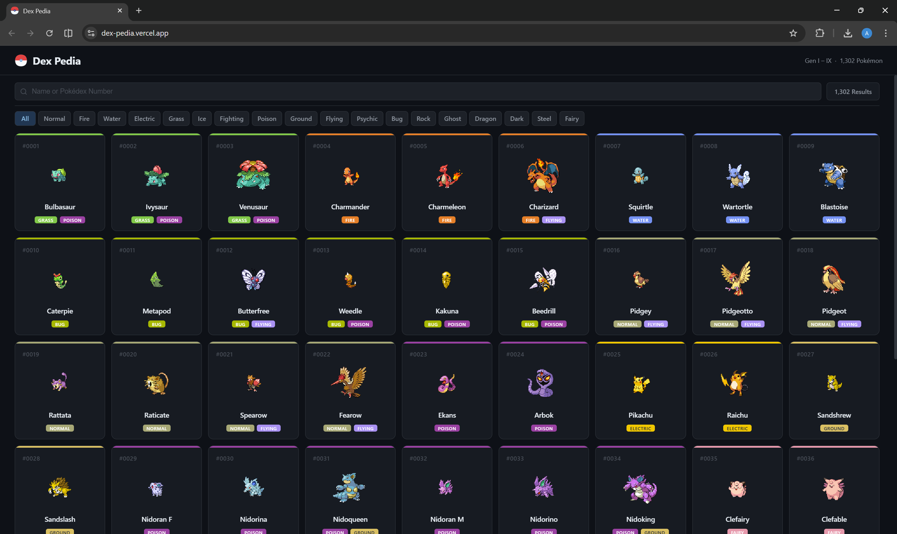

# Dex Pedia

## The Problem

Pokémon data is spread across wikis, fan sites, and official sources that are cluttered, inconsistently formatted, and not built for quick reference. Finding detailed stats, evolution chains, move lists, breeding info, and ability descriptions for a specific Pokémon typically requires jumping between multiple pages. There is no single, clean interface that consolidates all of this into one place.

## The Solution

Dex Pedia pulls data directly from the PokéAPI to create a complete, searchable Pokémon encyclopedia covering all 1,302 Pokémon across Generations I–IX. Users can browse and filter by name, Pokédex number, or type, and click into any Pokémon for a full detail view covering stats, abilities, moves, breeding, and evolution chains — all in one focused interface.

## Tech Stack

